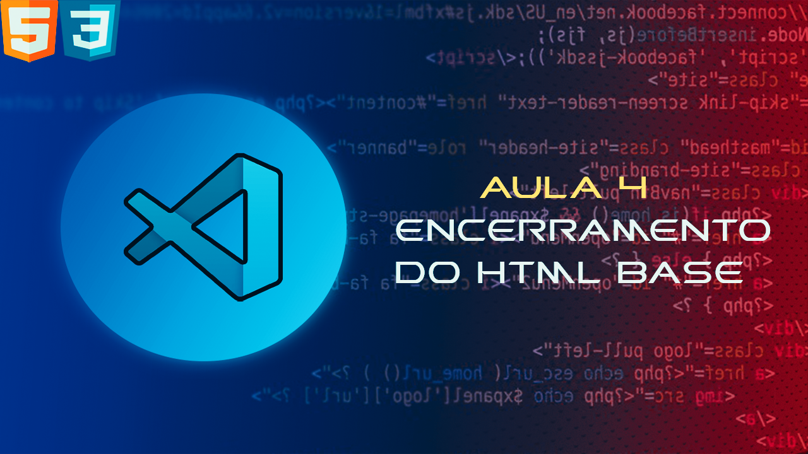

# 
Codes Lesson 4: HTML Closure

> GitHub project based on my classes of the my YouTube channel

## 🤝 Colaboradores

Agradecemos às seguintes pessoas que contribuíram para este projeto:

<table>
  <tr>
    <td align="center">
      <a href="#">
         
        
          <b>Wk86</b>
           
          
Tumb do projeto

        
      </a>
    </td>
    <td align="center">
      <a href="#">
         
        
          <b>Bekn</b>
          
Produção do Projeto

        
      </a>
    </td>
  </tr>
</table>
